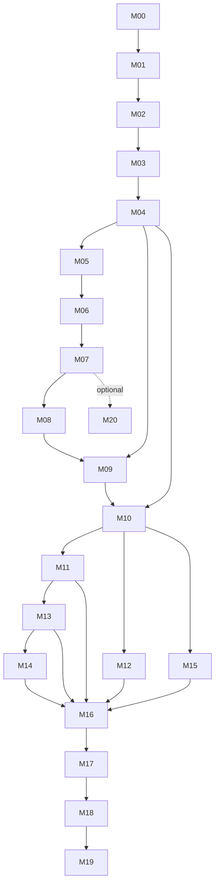

# Complete milestone plan

All original milestone work, dependencies, deliverables and acceptance text below are retained from the user-adopted brief. The explicitly dated launcher amendment extends them without changing the preserved source brief. This is the execution backlog, not achieved functionality. Status vocabulary: TODO, IN_PROGRESS, IMPLEMENTED_NOT_RUN, VERIFIED, BLOCKED. Native completion requires original-game evidence.

| ID | Objective | Status |
|---|---|---|
| M00 | Establish the project contract and actionable backlog | VERIFIED |
| M01 | Reproducible build, compatibility guard, and save protection | VERIFIED |
| M02 | Native-behavior baseline and engine observability | TODO |
| M03 | Multiple actors using original gameplay functions | TODO |
| M04 | Unattended original-game worker and isolation | TODO |
| M05 | Separate authoritative simulation from replica presentation | TODO |
| M06 | Real network session and authoritative scene replication | TODO |
| M07 | First complete native shared encounter | TODO |
| M08 | Native content, terrain, and editor-commit foundation | TODO |
| M09 | Durable checkpoints, reconnects, and crash recovery | TODO |
| M10 | One universe across multiple native locations | TODO |
| M11 | Creature stage gameplay coverage | TODO |
| M12 | Cell stage gameplay coverage | TODO |
| M13 | Tribal stage gameplay coverage | TODO |
| M14 | Civilization stage gameplay coverage | TODO |
| M15 | Space stage and persistent galaxy gameplay | TODO |
| M16 | Mixed stages and cross-location consequences | TODO |
| M17 | Native editors and the full Cell-to-Space campaign | TODO |
| M18 | Usable hosting, Internet operation, security, and capacity | TODO |
| M19 | Release qualification and complete deliverables | TODO |
| M20 | Optional extension: Galactic Adventures multiplayer | TODO |

M00/M01 session detail: `evidence/2026-09-08-m00-m01/SESSION.md`. Later milestones have no changed modules, commands or results yet; their native tests are NOT RUN. Each milestone gets its own evidence record when work starts. No stage scope is deferred to optional M20.

## Required launcher amendment — 2026-09-08

The user requested a launcher, then required a much stronger visual design and maximum automatic setup. Deliver one Windows desktop application, extended alongside the relevant milestones; the final product must not depend on users assembling command lines or manually running a diagnostic checklist. See `docs/launcher.md` for implementation and evidence.

| Milestone | Additional launcher work and acceptance |
|---|---|
| M01 | Build a polished desktop executable with one clear primary action. Automatically detect installed copies through OS/store records and Steam libraries, check executable/content/prerequisites, create or reuse a verified personal file backup and prepare reusable working folders. Prompt only for missing/ambiguous installation choices or actionable errors. Keep paths, technical checks and local report export in Settings. Distinguish a directory workspace from OS isolation. The guarded native start path must refuse mismatches before injection. Test automatic cold/warm startup, the actual window and failure paths, as well as three isolated native lifecycles for overall M01 acceptance. |
| M04 | Add isolated worker selection and start/stop/status backed by the real supervisor; surface readiness, crash and desktop requirements. |
| M06 | Add server address/invitation, authenticated join, content/build denial and connection status backed by a real session. |
| M09 | Add rejoin and recovery status backed by authoritative restore; retain protected backup locations. |
| M18 | Complete host configuration, dedicated server controls, invitations, player management, support export and actionable Internet errors in this same launcher. Validate on a second machine. |
| M19 | Package and document the launcher, supported prerequisites, install/uninstall and recovery. A new user must host, join and resume through the shipped UI without developer intervention. |

No speculative server list, mock online players or enabled future-only buttons count as a deliverable. The launcher is required; Galactic Adventures remains optional M20, and every original M00–M20 acceptance section below remains in force.

Player-flow correction (2026-09-08): the user rejected mandatory separate profiles and personal-save gates. The M01 player launcher uses the normal Windows account and existing saves through Play SPORE. Compatibility checks run automatically; diagnostic details stay in Settings. Earlier isolated runs remain developer evidence, and optional backup/isolation tools remain available for future multi-process investigations. This explicit amendment overrides the earlier player backup/profile requirements; the original M00–M20 sections remain preserved below.

M01 accepted 2026-09-08: completed native bridge cycles and mismatch checks, plus user confirmation of the normal-account launcher. The user requested no further repeated tests. Evidence: evidence/2026-09-08-m01-native/SESSION.md. M02 is next; later acceptance remains unexecuted.

## Dependency graph

The graph shows major gating paths; the exact dependency text below is authoritative, including infrastructure work that can start earlier. M03 multi-actor gameplay and M04 isolation are explicit native gates. M18 hardening begins in M01; eight-client capacity remains an experiment.

### M00 — Establish the project contract and actionable backlog

**Dependencies:** none.

**Work:** Inspect the repository, toolchain, installed SDK/game, and available testing machines. Record existing code before changing it. Create GOAL.md, AGENTS.md, the full milestone checklist, and a concise STATUS.md. Write initial authority and architecture decisions from this brief. Separate native behavior, new multiplayer policy, and unknown engine capabilities. Map every required feature to an eventual acceptance test.

**Deliverables:** working project documents; prerequisite inventory; executable-build identification plan; dependency graph; initial test commands or a clearly identified missing toolchain.

**Acceptance:** the plan still includes every original stage, dedicated authority, independent locations/progression, reconnects, persistence, and engine reuse. It does not redefine the final product as a movement demonstration. Every unknown has a concrete investigation and an expected observable result. Begin M01 rather than ending the task with documents only.

### M01 — Reproducible build, compatibility guard, and save protection

**Dependencies:** M00.

**Work:** Build a minimal real ModAPI DLL for the locally verified executable. Pin the SDK and dependency revisions. Set the correct architecture, calling conventions, runtime linkage, and build configurations. Log bridge initialization/disposal after the appropriate lifecycle callbacks. Identify the game's actual file/configuration access locations. Create isolated disposable test profiles, back up personal saves, and add a compatibility validator that refuses unknown binaries or incompatible content before unsafe hooks attach.

**Deliverables:** build scripts, DLL artifact, a diagnostic launcher/command, compatibility manifest, isolated test workspace, and uninstall/rollback instructions.

**Acceptance:** a clean checkout builds with documented prerequisites. The DLL loads in the real game, records its verified build fingerprint, and exits cleanly. A deliberately mismatched build/configuration is rejected without attempting unsafe bindings. Test runs do not modify the user's personal save profile. Test multiple clean launches and exits, not just compilation.

### M02 — Native-behavior baseline and engine observability

**Dependencies:** M01.

**Work:** Add structured tracing for game mode, scene lifecycle, entity creation/destruction, player identity, native action entry/result, AI updates, damage/death, inventory/progression, and save/load as relevant bindings become verified. Establish reference runs with multiplayer mutations disabled. Inventory entry points for all five stages now, so later stage risk is visible early. Build a read-only diagnostic overlay or console and guarded investigation commands.

**Deliverables:** native-behavior baseline, binding registry, stage capability matrix, reusable fixtures, and research log containing reproductions rather than speculation.

**Acceptance:** at least one original gameplay action is traced from invocation to outcome with the original implementation still executing. Logs distinguish engine events from mod events. Lifecycle tests identify entity invalidation. Observational instrumentation does not double-apply actions or change the baseline behavior. Unidentified internals remain labeled unknown.

### M03 — Multiple actors using original gameplay functions

**Dependencies:** M02.

**Work:** In a controlled original-game scene, create/manage two independently owned actor representations. Drive both through native movement and action mechanisms, not transform-only teleports or custom attack formulas. Investigate local-avatar, player, species, faction, and inventory assumptions. Test actions during intervening AI ticks, delayed callbacks, death, and object recreation. Prefer verified per-actor entry points; carefully scoped context adaptation is an investigation, not an assumed solution.

**Deliverables:** engine-side command harness, actor ownership mapping, a native context audit, and recorded two-actor tests.

**Acceptance:** actor A and actor B can receive distinct commands; a native NPC can interact with either; damage, action attribution, and any tested rewards are assigned correctly. A command for A never spends B's resources. Native action processing—not merely a health setter—causes the outcomes. At least one asynchronous action completes under the correct identity. If the worker requires a native server-only avatar, prove it does not steal targets/rewards or silently determine which remote-player areas remain active. Record the exact behavior still unsupported.

**Critical gate:** if multi-actor gameplay is not verified, mark dependent multiplayer gameplay BLOCKED. Continue binding research and independent infrastructure, but do not substitute an invented simulator or mark movement as complete co-op.

### M04 — Unattended original-game worker and isolation

**Dependencies:** M01–M03 for an interactive worker acceptance test; basic supervision can start after M01.

**Work:** Implement coordinator-to-worker private IPC, readiness/health states, startup arguments/configuration, scene loading, controlled shutdown, and crash detection. Start with normal rendering. Investigate focus loss, minimization, dialogs, desktop-session requirements, process-instance restrictions, file locking, and configuration/global path use. Verify isolation using observed file access; changing one environment variable is not proof. Investigate native save/load of the controlled fixture and basic restoration of mod identities.

**Deliverables:** supervisor, worker configuration, isolated workspace manager, IPC protocol, and unattended operation instructions.

**Acceptance:** a worker runs the verified native action test without a human playing it; a player client can close without shutting down authority. Two worker processes operate on separate test workspaces without save/configuration cross-writes. Kill one and observe detection while the other remains healthy. Reload a controlled native checkpoint. State any required desktop or separate-user/VM setup honestly.

**Critical gate:** do not plan unlimited workers around unverified launch or persistence isolation.

### M05 — Separate authoritative simulation from replica presentation

**Dependencies:** M02–M04.

**Work:** Identify and control the client's duplicate AI decisions, damage/death, pickups, rewards, spawning, timers, and progression. Preserve local camera, UI, animation, audio, interpolation, and appropriate movement presentation. Add explicit execution roles and a replica-application guard. Design local movement prediction only around proven reversible state; never replay irreversible native rewards as part of prediction.

**Deliverables:** authority matrix, native hook policies, replica object lifecycle, and mutation-audit counters.

**Acceptance:** applying a worker result updates the client without triggering a second authoritative action or reward. Deliberately divergent local NPC decisions cannot permanently override the worker. Disabling the multiplayer connection does not allow a client to upload locally invented progress later. Single-player runs with multiplayer disabled retain the observational baseline.

### M06 — Real network session and authoritative scene replication

**Dependencies:** M04–M05.

**Work:** Integrate the selected transport, authenticate sessions, enforce protocol/build/content handshakes, and route to the dedicated worker. Implement global IDs, entity generations, scene epochs, reliable spawn/despawn, motion snapshots, interpolation, baseline acknowledgments, bounded queues, and basic reconnect. Separate engine calls from networking threads. Use explicit protocol schemas, not native memory dumps.

**Deliverables:** coordinator networking, game bridge transport/IPC integration, protocol tests, and a repeatable multi-process harness.

**Acceptance:** two real client game processes join one original-game worker, load a consistent fixture, and observe distinct controlled actors. Out-of-order motion cannot resurrect an entity or change scene ownership. Unsupported versions fail clearly. Malformed/oversized messages are rejected. A reconnect obtains a fresh authoritative baseline without duplicating a player.

### M07 — First complete native shared encounter

**Dependencies:** M03, M05, M06.

**Work:** Integrate original movement, target selection, AI response, attack execution, damage, death, at least one contested pickup/reward, and respawn or scene reset. Ensure client-origin requests reach the correct actor in the dedicated worker. Capture native action traces alongside authoritative network events and normalized shared-state digests.

**Deliverables:** an end-to-end shared encounter regression test with recordings, logs, and assertions.

**Acceptance:** both players fight the same NPC, which can target either player; all machines agree on its final health/death and the single reward outcome. Simultaneous pickup requests award the resource once. Reconnect after death does not restore the NPC or duplicate the reward. Repeat with configured latency/loss and with one client attempting an unauthorized action.

This is the first meaningful multiplayer integration slice, not the final product and not a reason to stop at one scene.

### M08 — Native content, terrain, and editor-commit foundation

**Dependencies:** M06–M07.

**Work:** Create a content-addressed manifest for custom creations and their dependencies; map global content identities to native resource keys. Verify the actual creation representation needed by the engine instead of assuming an image alone contains everything. Transfer only approved data, with size/dependency validation and a quarantined import path. Keep native assets installed locally. Synchronize canonical generated terrain and relevant world records, not just a random seed. Establish native editor begin/commit/cancel transactions, with immutable creation versions and authoritative native validation of the resulting gameplay properties.

**Deliverables:** content registry/cache, dependency checks, readiness barriers, terrain identity checks, and a basic editor transaction path.

**Acceptance:** a newly created native creature is loaded consistently by the worker and a clean second client. Its gameplay properties are checked through verified native behavior, not trusted client numbers. Missing parts or terrain mismatches block readiness with a precise error. Editing does not globally pause the session or publish a half-finished creature. Oversized, corrupt, or path-traversal content fails safely.

### M09 — Durable checkpoints, reconnects, and crash recovery

**Dependencies:** M04, M07, M08.

**Work:** Implement safe native checkpoints plus coordinator manifests and ID mappings. Define accepted/applied/durable acknowledgment semantics and rollback windows. Add backups, schema migration boundaries, consistent checkpoint barriers, and restore validation. Protect critical progression/inventory changes from duplicate application. Test abrupt termination at every boundary between a native action, event capture, database write, save artifact, and durable acknowledgment.

**Deliverables:** transactional store, artifact/checkpoint manager, recovery commands, crash-injection tests, and documented persistence contract.

**Acceptance:** restart the coordinator and worker, reconnect both clients, and restore the tested world, identities, creations, inventory, and progression. Duplicated/resubmitted requests do not grant duplicate rewards. A durable acknowledgment remains true after recovery. An interrupted checkpoint cannot replace the last good one. Any loss of non-durable transient motion is within the documented window. Passing mocks alone is insufficient.

### M10 — One universe across multiple native locations

**Dependencies:** M04, M08, M09.

**Work:** Add canonical universe/star/planet/location identifiers; worker scheduling; ownership leases and fencing; area activation/deactivation; and interest subscriptions. Establish who owns global native systems as well as local ones. Build a transfer state machine: prepare destination, validate content/checkpoint, quiesce and fence source authority, restore destination, commit ownership, and clean up. Persist each transfer step and support abort/recovery. Native outcomes from an old worker generation are rejected.

Initially use explicit test travel commands if necessary; these are test harness operations, not a replacement for the eventual native Space travel implementation.

**Deliverables:** universe coordinator, ownership matrix covering native background systems, transfer protocol, and split-brain tests.

**Acceptance:** players in two separately simulated locations share one canonical universe, can meet in the same scene, separate again, and reconnect without diverging histories. Killing either worker during every transfer step creates neither two authoritative avatars nor a lost persistent avatar. Two workers must not double-run the same global economy/diplomacy event. Prove shared consequences, not just shared planet names.

### M11 — Creature stage gameplay coverage

**Dependencies:** M07–M10.

**Work:** Implement the Creature stage adapter across movement, eating/hunger, combat, social actions, relationships, packs, nests, spawning/despawning, native unlocks/DNA, mating/editor return, death/respawn, and native progression inside the stage. Map per-player species state separately from local avatar state. Test distant players and camera-dependent activation. Connect outgoing stage-change requests to the transition contract; full cross-stage completion is M17.

**Deliverables:** Creature gameplay checklist, verified bindings, fixtures, and native-versus-multiplayer behavior comparisons.

**Acceptance:** two players can play the normal supported Creature loop with different ownership identities; social and combat outcomes agree; progression and creations persist. Player separation does not delete another player's active encounter. A player editing or disconnecting cannot freeze the other player's world or overwrite their species. Record any intentional shared-faction behavior separately. Run an extended session and repeat after restore.

### M12 — Cell stage gameplay coverage

**Dependencies:** M08–M10; reuse infrastructure, not assumptions about Creature classes.

**Work:** Investigate the native Cell-stage subsystem independently. Integrate control, collision, food, attacks/defenses, growth/scale changes, native part unlocks, editor return, death/restart, and progression within the stage. Define how cell-level sessions reference their canonical planet without inventing incompatible terrain or spatial correspondence. Support multiple cell players in the same relevant simulation, not only parallel solo cells.

**Deliverables:** Cell adapter, scale-aware state schema, native action traces, and stage tests.

**Acceptance:** two players interact with shared cell-stage entities; contested food is consumed once; collisions and native outcomes agree through growth changes. Native editor and death/restart behavior preserve correct ownership. Save/reconnect restores stage progress. Transition eligibility is recorded correctly for M17. Do not claim the stage works from a Creature-stage actor rendered smaller.

### M13 — Tribal stage gameplay coverage

**Dependencies:** M08–M11 infrastructure; M12 is not a code dependency.

**Work:** Integrate native unit selection/commands, gathering, food storage, tools, buildings, native population mechanics, combat, social/instrument interactions, gifts, relationships, and tribe progression. Distinguish human-owned tribes from AI tribes. Ensure native AI is retained for NPC tribes but cannot issue contradictory decisions for a player-owned tribe. Establish access controls for optional shared-tribe play.

**Deliverables:** Tribal adapter, faction permissions, multi-unit command protocol, and native economy/action tests.

**Acceptance:** two independently owned tribes can interact with each other and native NPC tribes. Resource spending, ownership, conquest/social outcomes, and progression agree. A client cannot command the other tribe's units or spend its food. Death, rebuilding, editor/configuration operations where applicable, reconnect, and checkpoint restore work. Preserve native calculations instead of moving a simplified resource loop into the coordinator.

### M14 — Civilization stage gameplay coverage

**Dependencies:** M08–M10 and faction/command infrastructure from M13.

**Work:** Integrate city ownership and management, buildings, native production, resource nodes, vehicle creation and controls, land/sea/air movement, military/economic/religious actions, diplomacy, native special abilities, and stage victory/progression. Audit implicit player-civilization state in UI and native action paths.

**Deliverables:** Civilization adapter, city/vehicle replication, ownership transfer handling, and three-strategy test fixtures.

**Acceptance:** two civilizations issue independent commands; the same city cannot be conquered or purchased inconsistently; production and resources are not double-counted. Exercise military, economic, and religious interactions, including concurrent requests. Reconnect and worker recovery preserve cities, vehicles, diplomacy, and progression. Completing a native stage goal produces one valid transition request for M17.

### M15 — Space stage and persistent galaxy gameplay

**Dependencies:** M08–M10 and mature faction/persistence infrastructure.

**Work:** Integrate native ship control and planet/system/galaxy travel; tools and combat; inventories, energy and currency; native trade and spice production; colonies and buildings; terraforming/ecosystems; relationships, missions, empire events, and native progression/unlocks. Route native travel through M10 transfers. Establish single ownership of galaxy-wide background simulation and correct treatment of unloaded areas using observed native behavior, not guessed offline-growth formulas.

**Deliverables:** Space adapter, native galaxy-state mapping, travel integration, world-event ownership tests, and inactive-area policy.

**Acceptance:** two independent empires explore different systems, meet, trade or fight under configured policy, alter a planet, leave, and observe the same result after returning and restarting the server. Inventory/currency cannot duplicate across travel or trade. Native background outcomes occur once, not per worker. Leaving a planet must not restore an older client's version. Do not certify this milestone from ship movement alone.

### M16 — Mixed stages and cross-location consequences

**Dependencies:** M10–M15 for the relevant stage combinations.

**Work:** Produce an explicit stage-pair interaction matrix. First prove independent stages coexist on separate planets; then prove relevant stages can share consequences on one planet. Investigate native tech-level assumptions, physical scale, stage-local representations, ownership, and how Space tools affect an occupied lower-stage world. Use one owner per affected world resource and verified native functions for effects. Do not run two independently authoritative versions of the same terrain, city, or population.

Some stage pairs have no direct native interaction. Mark those not applicable with an explanation, not a fictional new mechanic. Native cross-stage interactions relevant to the product may not be silently removed merely because they are difficult.

**Deliverables:** stage-pair matrix with status/evidence, canonical world projection rules, and cross-worker transaction tests.

**Acceptance:** at least one player remains in a lower stage while another is in Space; visiting or affecting that same world produces consistent supported native consequences in both views, survives reload, and does not forcibly advance the lower-stage player. The other applicable stage-pair scenarios have documented tests. No faction's advancement overwrites unrelated player progress. Untested/blocked interactions remain visibly incomplete.

### M17 — Native editors and the full Cell-to-Space campaign

**Dependencies:** M08–M16.

**Work:** Complete all required native editor transactions and all four campaign stage transitions. Bind native eligibility/unlock checks to persistent species ownership. Checkpoint before transitions, prepare destination context/content, execute the native transition where possible, commit the new state, and restore client presentation. Handle failures, cancellation, disconnection, concurrent edits, and simultaneous stage transitions. Define explicit consent/ownership behavior for shared-species progression.

The world continues for unaffected players. The editing player's native pause behavior must be mapped to a documented multiplayer policy rather than propagated as a global pause.

**Deliverables:** transition orchestration, per-editor coverage, progression lineage, resumable operations, and full campaign test scripts.

**Acceptance:** complete a genuine Cell -> Creature -> Tribal -> Civilization -> Space progression with multiplayer enabled, while another player progresses independently. Validate native prerequisites and inherited progress at every transition. Debug shortcuts can prepare fixtures but cannot be the only evidence that normal progression works. Interrupt each transition and editor commit, then recover without duplication, lost species, globally forced advancement, or cross-player state leakage.

### M18 — Usable hosting, Internet operation, security, and capacity

**Dependencies:** hardening starts with M01; complete integration depends on M06–M17.

**Work:** Provide client join/rejoin UI, standalone server start/stop/status, validated configuration, invitation/password or token authentication, player management, backups, diagnostics export, and actionable compatibility/content errors. Implement a verified direct-connect Internet deployment; add relay support only with an explicit real implementation and deployment requirements. Harden public endpoints, parser boundaries, content import, worker IPC, logging, and admin access. Avoid open unauthenticated admin/debug interfaces.

Measure bandwidth, snapshot behavior, native tick progress, CPU/RAM/GPU per worker, render/focus effects, input correction, save pauses, and capacity. Test two clients first, then the provisional eight-client workload on recorded hardware. Distinguish simulated protocol clients from real running game clients.

Investigate low-render/headless modes only behind optional capability flags. Keep them only if native behavior and lifecycle tests still pass; otherwise document the rendered-worker requirement and its costs.

**Deliverables:** usable launcher/server package, deployment/runbook, threat model, fuzz tests, measured operating envelope, and profiling report.

**Acceptance:** a second machine can join over a real Internet path with correct authentication; reconnect and denial paths work. Spoofed ownership, invalid action rates, stale commands, malformed content, replayed commands, and unauthorized administration do not mutate the world or expose arbitrary execution. Test configured 100 ms RTT/20 ms jitter/1% loss and a harsher 150 ms RTT/30 ms jitter/2% loss profile. Correctness survives; publish measured responsiveness rather than inventing a performance claim. State any port, desktop, GPU, and supported-capacity requirements.

### M19 — Release qualification and complete deliverables

**Dependencies:** M00–M18 verified for required scope.

**Work:** Run the release test matrix on clean installs. Exercise each stage, full campaign, independent progression, mixed-stage interactions, editor transactions, multi-location travel, dedicated persistence, backup/restore, compatibility failures, disconnects, content mismatch, native worker crashes, coordinator crashes, and network partitions. Include a multi-hour soak and repeated lifecycle/transfer tests. Audit the feature matrix for hidden stubs and behaviors implemented only in mocks.

Package source/build scripts, the bridge DLL, coordinator/supervisor, launcher/install tooling, example configuration, end-user instructions, operator guide, supported-version/content matrix, recovery guide, troubleshooting, known limitations, and test evidence. Distribute only project-owned/permitted code and artifacts; require the operator's and players' own original game installations. Do not bundle EA executables/assets or introduce licensing/authentication bypasses.

**Acceptance:** a new user can follow the documentation, host the supported dedicated configuration, join with another user, play the supported all-stage campaign, disconnect, restart, and resume without developer intervention. The release matrix contains no unimplemented mandatory feature disguised as a limitation. Any unresolved requirement keeps the build labeled partial/experimental rather than global-complete. Give a measured supported player/worker configuration, not an unlimited scaling claim.

### M20 — Optional extension: Galactic Adventures multiplayer

**Dependencies:** relevant creature, content, authority, and persistence foundations. This can be investigated earlier, but it must not displace M11–M19.

**Work:** Integrate native adventures, captains, abilities, props, pickups, objectives, mission state, completion, and rewards. Handle adventure-specific assumptions about one captain and objective ownership. Reuse the original adventure system rather than authoring an unrelated mission engine.

**Acceptance:** two players finish shared native objectives and receive the intended non-duplicated rewards; late join, reconnect, and worker recovery preserve mission state. Maintain an adventure compatibility matrix. Do not claim every user-authored adventure works from a single purpose-built test.
