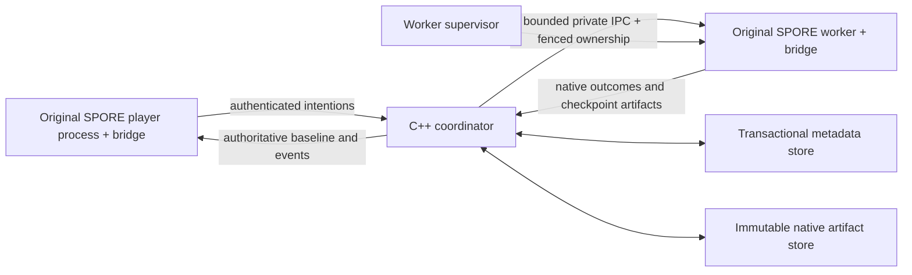

# Architecture — initial decisions

Status: architectural contract, **not implemented multiplayer functionality**. M01 tooling and the M02 observation baseline are qualified for their recorded configuration. M02's 2026-09-09 native pair verifies the selected Creature action, scene and diagnostic paths; other stages and multiplayer capabilities remain unqualified. Required product scope is in `../GOAL.md`; all milestones remain in `../MILESTONES.md`.

## Original engine owns gameplay

The bridge runs inside an original SPORE process. A player process retains native UI, camera, animation, audio and editors; it submits intentions. An authoritative worker process invokes verified native actions and observes their outcomes. The C++ coordinator handles authentication, stable IDs, authority generations, routing, supervision and transactional metadata. It contains no replacement combat, AI, pathfinding, production, evolution or generation model.

This is a proposed complete execution flow. M04 qualifies the local worker supervisor/private IPC subset through concurrent original-game processes, native actions, actual player closure and retained crash tests. The controlled native checkpoint now reloads in fresh generations and restores basic A/B ownership by adopting exact existing saved nouns. M05 adds a bounded living Creature avatar vitals projection between isolated original processes, selected native mutation guards, immutable roles and a fenced local replica registry. Full transactional identity/progression recovery, network sessions, complete replica presentation and global authority remain unfinished. See [M04 process, protocol and native boundaries](m04-workers.md) and [M05 implemented subset and remaining gates](m05-replicas.md).

## Boundaries

- Only `src/bridge` includes ModAPI headers or depends on the game ABI. The current bridge is Win32, C++17, MSVC v143, /MD in Release and /MDd in Debug. Future coordinator language/toolchain choices must not alter that ABI.
- One coordinator with a local transactional store is the initial deployment. A rendered unattended original-game worker is acceptable; headless flags and render suppression are unproven.
- Native context partition size is unresolved. Do not assume one planet, one player or one stage per process. Co-located players share authoritative simulation; workers in other locations remain part of the same canonical universe.
- Own player/species/faction identities outlive connections and native pointers. Explicit shared-faction policy is separate from engine mechanics.
- Network threads decode bounded messages into queues. Verified engine-thread boundaries resolve stable IDs to current objects; queued work cannot retain unsafe raw engine pointers.
- Replica application and original-function detours need reentrancy guards and explicit execution roles. No prediction of irreversible rewards or unverified replay.
- Native simulation time and snapshot transmission cadence are separate. Preserve timer meanings through transitions and restores; no new timestep semantics without behavioral comparison.

## M01 lifecycle decision

The bridge follows the pinned SDK's `AddPostInitFunction` / `AddDisposeFunction` registration pattern. DllMain only registers these callbacks; the bridge installs no detours or gameplay hooks. Hashing and log I/O occur in the initialization callback. Disposal flushes and closes diagnostics through the SDK callback, never during DLL detach.

The upstream core hooks during DLL load, so the implemented native host validates compiled game/content/payload hashes before process creation and injection. Normal Play uses the player's account and saves. Optional separate-account tooling retains the earlier developer checks. Three original-game bridge lifecycles and final user acceptance complete M01.

M02 adds seven opt-in gameplay detours installed after SDK post-init and removed during SDK disposal, outside loader lock. Engine calls still run on their original paths. Only fixed-size scalar observations and opaque diagnostic IDs enter a bounded local trace; no coordinator/network or gameplay mutation was added. Normal Play clears the experimental switch. The accepted native fixture, measured presentation/CPU samples and remaining lifetime/thread/gameplay limits are in `m02-binding-registry.md` and `../evidence/2026-09-09-m02-completion/SESSION.md`.

## Persistence and world ownership

The coordinator fences one authority per mutable domain and stores immutable artifact manifests. Native files remain engine data. A native side effect and a database transaction are not inherently atomic; M09 defines accepted/applied/durable acknowledgments and tests kills across every boundary.

Native caches on workers do not grant mutation authority. Galaxy AI, economy, disasters and diplomacy require auditing even when off-screen. Restore/transfer may not double-run these global systems. Never combine live save directories, merge arbitrary galaxy databases or accept client saves as authoritative.

H1–H6 investigation gates and their expected observations are in `research-log.md`. M03 multi-actor failure blocks dependent gameplay; it does not authorize a custom gameplay simulator. M20 adventures remain optional.
